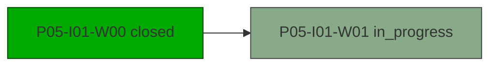

# Plan: P05-I01 — Iter One

> Status: active · Phase: P05 (Phase Five) · Opened: 2026-05-08T00:00:00Z

## Summary
- waves: 2 (1 in_progress, 1 closed)
- effort: sum_wave_eu=0, critical_path_eu=0, actual_elapsed_eu=0
- checks: 1/1 passed
- risks: 0 open
- blocked: none

## DAG

## Waves
| Wave | Status | Bucket | Role | Estimate EU | Success criteria | Files |
| --- | --- | --- | --- | ---: | --- | --- |
| [x] **P05-I01-W00** Bootstrap | closed | - | - | 0 | - | src/core/__init__.py |
| [ ] **P05-I01-W01** Implement core | in_progress; deps: W00 | - | - | 0 | - | src/core/run.py |

## Checks
- [x] **ok** (P05-I01-W00 outcome) — passed

## Risks
(none)
