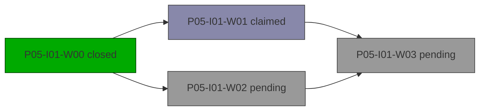

# Plan: P05-I01 — Branch and merge

> Status: active · Phase: P05 (Phase Five) · Opened: 2026-05-08T00:00:00Z

## Summary
- waves: 4 (2 pending, 1 claimed, 1 closed)
- effort: sum_wave_eu=0, critical_path_eu=0, actual_elapsed_eu=2
- checks: 2/3 passed
- risks: 0 open
- blocked: P05-I01-W03

## DAG

## Waves
| Wave | Status | Bucket | Role | Estimate EU | Success criteria | Files |
| --- | --- | --- | --- | ---: | --- | --- |
| [x] **P05-I01-W00** Init | closed | - | - | 0 | - | src/cp/init.py |
| [ ] **P05-I01-W01** Branch A | claimed by S-A | - | - | 0 | - | src/cp/a.py |
| [ ] **P05-I01-W02** Branch B | pending; deps: W00 | - | - | 0 | - | src/cp/b.py |
| [ ] **P05-I01-W03** Merge | pending; deps: W01, W02 | - | - | 0 | - | src/cp/merge.py |

## Checks
- [x] **ruff_clean** (P05-I01-W01 audit AU-W01) — passed
- [ ] **tests_green** (P05-I01-W01 audit AU-W01) — failed: two failures
- [x] **ok** (P05-I01-W00 outcome) — passed

## Risks
(none)
