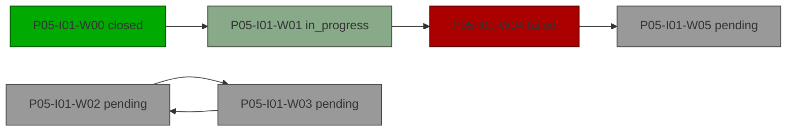

# Plan: P05-I01 — Cycle plus risks

> Status: active · Phase: P05 (Phase Five) · Opened: 2026-05-08T00:00:00Z

## Summary
- waves: 6 (3 pending, 1 in_progress, 1 closed, 1 failed)
- checks: 3/4 passed
- risks: 4 open
- blocked: P05-I01-W02, P05-I01-W03, P05-I01-W05

## DAG
WARNING: cycle detected: P05-I01-W02 -> P05-I01-W03

## Waves
- [x] **P05-I01-W00** — Bootstrap (closed @ 1111111)
- [ ] **P05-I01-W01** — Stage A (in_progress; deps: W00)
- [ ] **P05-I01-W02** — Cycle node B (pending; deps: W03)
- [ ] **P05-I01-W03** — Cycle node C (pending; deps: W02)
- [ ] **P05-I01-W04** — Failure (failed; deps: W01)
- [ ] **P05-I01-W05** — Final (pending; deps: W04)

## Checks
- [x] **ruff_clean** (iter audit AU-ITER) — passed
- [ ] **mypy_strict** (iter audit AU-ITER) — failed: errors in core
- [x] **tests_green** (iter audit AU-ITER) — passed
- [x] **ok** (P05-I01-W00 outcome) — passed

## Risks
| ID | Kind | Severity | Title |
| --- | --- | --- | --- |
| BL-1 | backlog | P0 | fix flake on W03 |
| INC-1 | incident | high | lock collision on W04 |
| BL-2 | backlog | P1 | improve audit driver |
| H05-01 | hypothesis_rejected | rejected | approach X scales beyond 1k waves |
